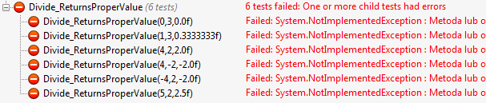

[W poprzedniej części kursu](/posts/kurs-tdd-4-nasz-pierwszy-test-jednostkowy) "Kurs TDD część 4: Nasz pierwszy test jednostkowy") omówiłem w jaki sposób ustawić środowisko Visual Studio aby móc pisać i uruchamiać testy. W tej części omówię jak wykonać kilka prostych technik, tj. jak:

*   zgrupować testy za pomocą atrybutu `[TestCase]`,
*   testować wyjątki,
*   testować zdarzenia.

Na tapetę idzie przykład dzielenia; chcemy napisać funkcjonalność i testy mając na uwadze, że:

*   metoda `Divide` należy do klasy `Calculator`,
*   metoda `Divide` przyjmuje dwa parametry wejściowe — obydwa typu int; zwracanym typem jest float,
*   po skończonym obliczeniu wywoływane jest zdarzenie `CalculatedEvent`,
*   w przypadku, gdy dzielnik jest równy 0, wyrzucamy wyjątek typu `DivideByZeroException`.

I tyle! Początkowy szkielet klasy Calculator wyglądać będzie tak:

```csharp
class Calculator
{
    public float Divide(int dividend, int divisor)
    {
        throw new NotImplementedException();
    }
 
    public event EventHandler CalculatedEvent;
 
    protected virtual void OnCalculated()
    {
        var handler = CalculatedEvent;
        if (handler != null) handler(this, EventArgs.Empty);
    }
}
```

# Test przypadków niebrzegowych i brzegowych

Pamiętając, że na wejściu mamy dwa inty, a na wyjściu float możemy rozpisać tablicę przypadków, dla których chcemy sprawdzić poprawność naszego wyniku. Mogą to być następujące testy:

*   dzielenie liczb dodatnich, zwracany typ jest liczbą całkowitą, np. 4 ÷ 2 = 2,
*   dzielenie liczby dodatniej przez ujemną i odwrotnie, zwracany typ jest liczbą całkowitą, np. -4 ÷ 2 = -2 i 4 ÷ (-2) = -2,
*   dzielenie zera przez dowolną liczbę, np. 0 ÷ 3 = 0,
*   zwracany typ jest ułamkiem skończonym, np. 5 ÷ 2 = 2,5,
*   zwracany typ jest ułamkiem nieskończonym lub zaokrąglonym, np. 1 ÷ 3 = 0,333333343f.<sup>[1]</sup>

Aby uniknąć pisania sześciu metod (można, ale da się to zrobić lepiej) czy też pisania wszystkich asercji w jednym teście ([co, jak już wiemy, jest złym wzorcem](/posts/kurs-tdd-4-nasz-pierwszy-test-jednostkowy/ "Kurs TDD część 4: Nasz pierwszy test jednostkowy")) możemy skorzystać z NUnitowego atrybutu [`[TestCase]`](https://github.com/nunit/docs/wiki/TestCase-Attribute). Jako parametry atrybutu podajemy dane wejściowe oraz (opcjonalnie) wartość oczekiwaną, natomiast definicja poszczególnych elementów zawarta jest w parametrach testu jednostkowego. Nasz test będzie wyglądać tak: 

```csharp
[TestCase(4, 2, 2.0f)]
[TestCase(-4, 2, -2.0f)]
[TestCase(4, -2, -2.0f)]
[TestCase(0, 3, 0.0f)]
[TestCase(5, 2, 2.5f)]
[TestCase(1, 3, 0.333333343f)]
public void Divide_ReturnsProperValue(int dividend, int divisor, float expectedQuotient)
{
    var calc = new Calculator();
    var quotient = calc.Divide(dividend, divisor);
    Assert.AreEqual(expectedQuotient, quotient);
}
```

 Dzięki atrybutowi `[TestCase]` mamy 6 testów w jednej metodzie. W okienku rezultatów testu, wszystkie pojawiają się jako podrzędne do głównego testu. Wygląda to tak:
 
 
 
 Bardzo ważna kwestia jaka tutaj się pojawiła to przypadek dzielenia 1 ÷ 3. Dzięki arytmetyce liczb zmiennoprzecinkowych uzyskamy wynik 0.3333333**4**3f. Wyjaśnienie skąd się wział taki wynik znajduje się w literaturze zamieszczonej w przypisach. Najważniejsza jest jednak świadomość tego faktu i uwzględnienie go w testach.

# Testowanie wyrzucenia wyjątku

W przypadku dzielenia musimy obsłużyć przypadek dzielenia przez zero. Założyliśmy, że w takim przypadku wyrzucamy błąd typu `System.DivideByZeroException`. W NUnicie testowanie wyjątków możemy wykonać przez wywołanie [`[Assert.Throws`]](https://github.com/nunit/docs/wiki/Assert.Throws). Tutaj również podanie typu jest opcjonalne. Jako parametr przekazujemy delegat kodu, który chcemy wykonać.

```csharp
[Test]
public void Divide_DivisionByZero_ThrowsException()
{
    var calc = new Calculator();
    Assert.Throws<DivideByZeroException>(() => calc.Divide(2, 0));
}
```
 Wyrażenie lambda możemy zastąpić anonimową metodą: 
```csharp
Assert.Throws(delegate { calc.Divide(2, 0); });
```

# Testowanie zdarzenia

Założyliśmy, że po wykonaniu obliczeń, wołamy zdarzenie `CalculatedEvent`. Sam NUnit nie wspiera natywnie testowania zdarzeń, jednak możemy zastosować prosty trik—po wywołaniu zdarzenia zmieniamy wartość flagi. Asercji dokonujemy na podstawie wartości tej flagi. Jeśli zdarzenie zostało wywołane, test przechodzi pozytywnie: 
```csharp
[Test]
public void Divide_OnCalculatedEventIsCalled()
{
    var calc = new Calculator();
 
    bool wasEventCalled = false;
    calc.CalculatedEvent += (sender, args) => wasEventCalled = true;
 
    calc.Divide(1, 2);
 
    Assert.IsTrue(wasEventCalled);
}
```
 Wyrażenie lambda możemy zastąpić anonimową metodą: 

```csharp
calc.CalculatedEvent += delegate { wasEventCalled = true; };
```
# Implementacja

Po napisaniu testów do naszego kodu, możemy przystąpić do napisania implementacji metody dzielenia. Zachęcam do napisania implementacji we własnym zakresie!

Ostateczna postać klasy wygląda tak: 
```csharp
class Calculator
{
    public float Divide(int dividend, int divisor)
    {
        if (divisor == 0) throw new DivideByZeroException();
 
        float result = (float)dividend / divisor;
        OnCalculated();
        return result;
    }
 
    public event EventHandler CalculatedEvent;
 
    protected virtual void OnCalculated()
    {
        var handler = CalculatedEvent;
        if (handler != null) handler(this, EventArgs.Empty);
    }
}
```
 Wszystkie testy są zielone. W tak prostym przykładzie nie trzeba nic refaktoryzować! _Fin!_

# Podsumowanie

W tej części kursu poznaliśmy:

*   Przydatność atrybutu `[TestCase]`, który niewielkim kosztem generuje przypadek testowy.
*   Sposoby testowania wyjątków za pomocą NUnit.
*   Sposób testowania zdarzeń.

Ponadto dowiedliśmy że _float_, ze względu na arytmetykę liczb zmiennoprzecinkowych, nie jest odpowiednim typem jako typ zwracany przy dzieleniu. Lepszym okazałby się _decimal_. Wybrałem jednak _float_, aby pokazać naturę testów. Oczekujemy nie do końca prawidłowej (z punktu widzenia matematycznego) wartości (przypadek dzielenia 1 ÷ 3) i dzięki temu pojawienie się oczekiwanego wyniku nie powinno nas zaskoczyć. Dzięki TDD wykrylibyśmy taki błąd przy zmianie typu zwracanego: np. z _decimal_ na _float_. Dobranie typu parametrów wejściowych jako _int_ też jest celowe, choć w praktyce bardzo niebezpieczne. Na szczególną uwagę zasługuje linijka: 

```csharp
float result = (float)dividend / divisor;
```
 Jaki wynik otrzymalibyśmy bez rzutowania zmiennej dividend na float? Zachęcam do eksperymentowania.

# Przypisy

<sup>[1]</sup> Dlaczego 1 ÷ 3 = 0,333333343f? Czytaj więcej na ten temat:

*   [C# 5.0 in a Nutshell](http://books.google.pl/books?id=t1de8nSVYnkC&pg=PA234&lpg=PA234&dq=0.333333343+float+c%23&source=bl&ots=24tgZxIm6z&sig=U_te6Rc-o5mnNukFVtz5gkv_45o&hl=en&sa=X&ei=y3blUbPuD4HUtQbi34Eg&redir_esc=y#v=onepage&q=0.333333343%20float%20c%23&f=false)
*   [C# in Depth: Binary floating point and .NET](http://csharpindepth.com/Articles/General/FloatingPoint.aspx)
*   [Stack Overflow: Precision issues with Visual Studio 2010](http://stackoverflow.com/questions/8520160/precision-issues-with-visual-studio-2010)