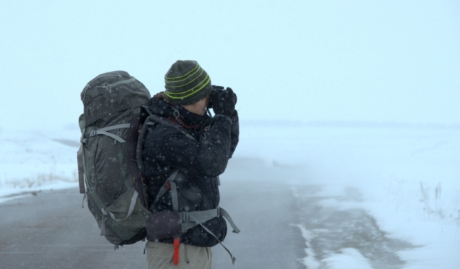

Cześć, jestem Darek!

Jestem pasjonatem programowania oraz technik, metodyk i filozofii jego tworzenia (agile, lean i kanban). Uważam się za rzemieślnika programowania ([software craftsman](http://manifesto.softwarecraftsmanship.org/)). Jestem również [autorem książki o TDD](/ksiazka-tdd/) wydanej przez Helion.

Prócz samego programowania, uwielbiam podróże, a w szczególności do mniej znanych i nie zatłoczonych zakątków także naszego kraju. Zwiedziłem już ponad 50 krajów, wliczając częściowo uznawane republiki – Górski Karabach (republika Arcach), Republika Naddniestrza, Cypr Północny i Kosowo. Najchętniej podróżuję autostopem, rowerem i pociągiem. Lubię wracać do miejsc, w których już byłem i podróżować w wolniejszym tempie, nie zważając na [ilość zwiedzonych państw czy przebytych kilometrów](http://admiring-diversity.pl/blog/2016/06/07/podrozowanie-blisko-powoli-opowiesc-o-odkrywaniu/).

<small>Armenia \ W drodze do Karabachu</small>

Pasjonuje się również uliczną fotografią; swoje zdjęcia uliczne i podróżnicze publikuję na [Instagramie](https://www.instagram.com/darek_wozn).

Staram się maksymalnie wykorzystać wolny czas również na inne zajęcia, w tym jazdę na rowerze i squash, ale także na dobry sen i medytację.

Jeśli pragniesz się ze mną skontaktować, to pisz śmiało na mój adres mailowy: dariusz.wozniak \[at\] gmail.com.
