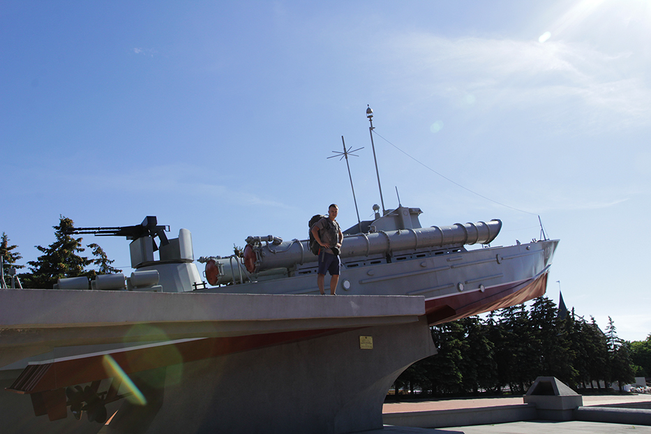

Cześć, jestem Darek!

Jestem pasjonatem programowania oraz technik, metodyk i filozofii jego tworzenia (agile, lean i kanban). Uważam się za rzemieślnika programowania ([software craftsman](http://manifesto.softwarecraftsmanship.org/)). Jestem również [autorem książki o TDD](/ksiazka-tdd/) wydanej przez Helion, certyfikowanym [scrum masterem](https://www.scrumalliance.org/get-certified/scrummaster-track/certified-scrummaster) i [product ownerem](https://www.scrumalliance.org/get-certified/product-owner-track/certified-scrum-product-owner).

Prócz samego programowania, uwielbiam podróże, a w szczególności do mniej znanych i nie zatłoczonych zakątków także naszego kraju. Zwiedziłem już 40 krajów, wliczając częściowo uznawane republiki – Górski Karabach (republika Arcach), Republika Naddniestrza i Kosowo. Najchętniej podróżuję autostopem, rowerem i pociągiem. Lubię wracać do miejsc, w których już byłem i podróżować w wolniejszym tempie, nie zważając na [ilość zwiedzonych państw czy przebytych kilometrów](http://admiring-diversity.pl/blog/2016/06/07/podrozowanie-blisko-powoli-opowiesc-o-odkrywaniu/).

<small>Kaliningrad</small>

Pasjonuje się również [uliczną fotografią](http://erickimphotography.com/blog/2013/08/07/what-is-street-photography-2/), a przez to jestem też [flânerem](https://en.wikipedia.org/wiki/Fl%C3%A2neur). Swoje zdjęcia uliczne i podróżnicze publikuję na [Flickrze](https://www.flickr.com/photos/dariuszwozniak/albums) i, od stosunkowo niedawna, [Instagramie](https://www.instagram.com/dariusz.wozniak.75) (zapraszam!).

Staram się maksymalnie wykorzystać wolny czas również na inne zajęcia, w tym jazdę na rowerze i squash, ale także na [dobry sen](http://routineexcellence.com/why-we-sleep-book-review-summary/) i medytację.

Jeśli pragniesz się ze mną skontaktować, to pisz śmiało na mój adres mailowy: dariusz.wozniak \[at\] gmail.com.